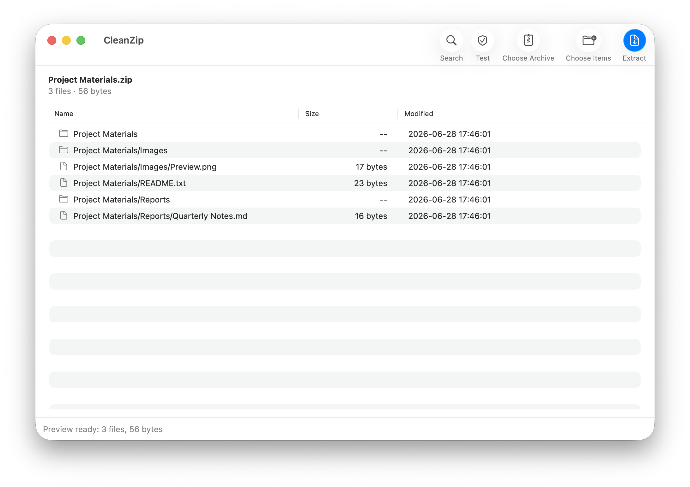
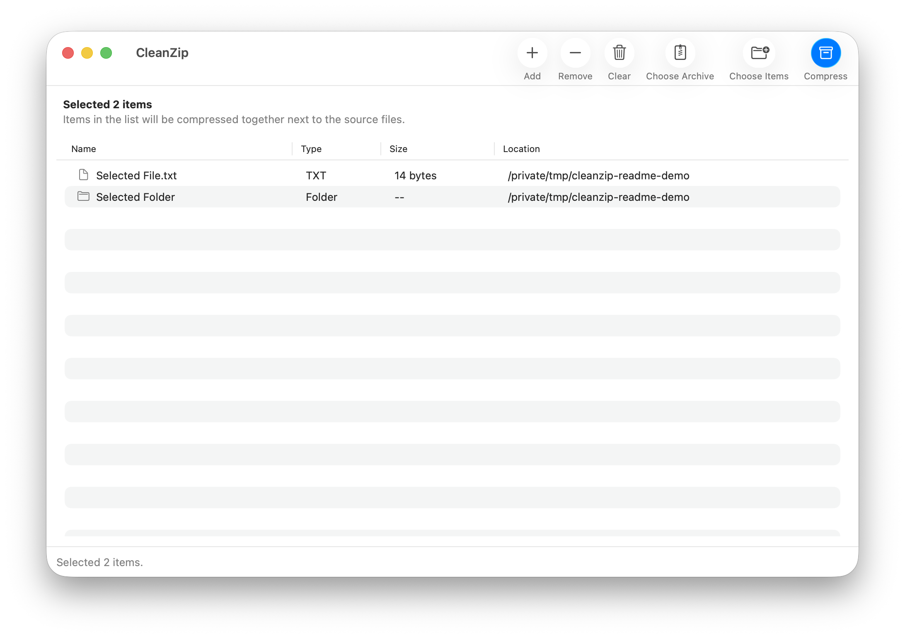

# CleanZip

<p align="center">
  
</p>

<p align="center">
  <strong>A lightweight native macOS archive app for clean ZIPs, RAR/7Z extraction, quick previews, Finder right-click actions, and split archives.</strong>
</p>

<p align="center">
  <a href="https://github.com/lyc280705/CleanZip/releases/latest">Download latest release</a>
  ·
  <a href="https://lyc280705.github.io/CleanZip/">Product page</a>
  ·
  <a href="https://github.com/lyc280705/CleanZip/releases/tag/v2.6.30">CleanZip 2.6.30</a>
  ·
  <a href="#build-from-source">Build from source</a>
</p>

<p align="center">
  <a href="https://github.com/lyc280705/CleanZip/releases/latest"></a>
  
  
  
  <a href="LICENSE"></a>
</p>

CleanZip is built for the everyday archive jobs that should be fast and boring: create ZIP files that do not contain macOS metadata, remove `.DS_Store` noise before sharing, inspect an archive before extracting it, split large archives, and use one clear Finder action instead of a crowded context menu.

It is intentionally small: no always-on background app, no history database, no archive editor, and no heavy all-in-one file manager.

## Best For

- Sending ZIP files to Windows or Linux users without hidden macOS metadata.
- Quickly previewing ZIP, 7Z, RAR, TAR, and other archives before extracting them.
- Creating split ZIP or split 7Z archives for upload limits.
- Keeping Finder's right-click menu simple with one compress/extract action.
- Using a local-first archive utility that does not upload files or keep history.
- Running the same app on supported Intel and Apple Silicon Macs.

## Screenshots

<p align="center">
  
</p>

<p align="center">
  <em>Preview archive contents before extracting.</em>
</p>

<p align="center">
  
</p>

<p align="center">
  <em>Manage selected files and folders, then create a clean archive.</em>
</p>

## Download

Download `CleanZip-2.6.30.pkg` from the [latest release](https://github.com/lyc280705/CleanZip/releases/latest). For most users, the `.pkg` installer is the easiest option.

The installer places:

- `CleanZip.app` in `/Applications`
- `CleanZipService.service` in `/Library/Services`

CleanZip is ad-hoc signed for open source distribution, but it is not notarized with an Apple Developer ID. macOS may block the installer before it opens and show a warning such as "Apple could not verify CleanZip is free of malware."

For the `.pkg` installer:

1. In Finder, Control-click `CleanZip-2.6.30.pkg` and choose **Open**.
2. If the same warning still appears with only **Done** and **Move to Trash**, open **System Settings** -> **Privacy & Security**.
3. At the bottom of Privacy & Security, choose **Open Anyway** for `CleanZip-2.6.30.pkg`, then confirm.

After installation, if macOS blocks `CleanZip.app` itself, Control-click `CleanZip.app` in `/Applications` and choose **Open**. If it is still blocked, use **System Settings** -> **Privacy & Security** -> **Open Anyway** for `CleanZip.app`.

After you approve the installer or app once, macOS opens it normally.

Advanced terminal alternative for the downloaded package:

```bash
xattr -dr com.apple.quarantine ~/Downloads/CleanZip-2.6.30.pkg
open ~/Downloads/CleanZip-2.6.30.pkg
```

Manual installation is also available from `CleanZip-2.6.30.zip`: move `CleanZip.app` to `/Applications` and `CleanZipService.service` to `/Library/Services`.

## Compatibility

CleanZip requires macOS 14 or later. The app, Finder service, and bundled `7zz` helper are universal binaries with both x86_64 and arm64 slices, so the same download works on supported Intel and Apple Silicon Macs.

On macOS 26, CleanZip uses Liquid Glass interface effects where available. On macOS 14 and 15, it falls back to native AppKit visual effects and standard toolbar behavior.

## Features

| Area | Details |
| --- | --- |
| Clean compression | Creates clean ZIP output and excludes `.DS_Store`, `__MACOSX/`, and `._*` metadata. |
| Finder integration | Adds one right-click service for compressing ordinary files/folders or extracting archives. |
| Archive preview | Lists archive contents with name, size, modified time, and folder structure. Includes search. |
| Extraction | Extracts common formats through bundled `7zz` and system tools. |
| Split archive creation | Supports split ZIP and split 7Z creation with common presets and custom sizes. |
| Progress | Shows progress for larger compression and extraction jobs in the app and lightweight service HUD. |
| Compatibility | Universal app for supported Intel and Apple Silicon Macs running macOS 14 or later. |
| Localization | Localized app UI, Finder service menu, notifications, errors, and document metadata. |

## Supported Formats

CleanZip can preview and extract common archive formats supported by bundled `7zz`, including:

- ZIP, 7Z, RAR
- TAR, TGZ, GZ, BZ2, XZ, ZST
- ISO, CAB, DMG, XAR
- JAR, WAR, APK
- split ZIP and split 7Z archives

CleanZip creates regular ZIP, split ZIP, regular 7Z, and split 7Z archives. It does not create RAR archives.

## Supported Languages

CleanZip follows the user's macOS language preferences and falls back to English when a preferred language is unavailable.

- English
- Simplified Chinese
- Traditional Chinese
- Japanese
- Korean
- French
- German
- Spanish
- Italian
- Brazilian Portuguese
- Russian

## Privacy

CleanZip runs locally on your Mac. Archive operations are performed with local system tools and the bundled `7zz` binary. It does not upload files, phone home, keep a history database, or run a permanent background service.

## Repository Layout

- `work/CleanZipBuild/src/main.swift`: main AppKit/SwiftUI app.
- `work/CleanZipBuild/src/service.swift`: Finder service helper.
- `work/CleanZipBuild/CleanZip.xcodeproj`: canonical Xcode project used for release builds.
- `work/CleanZipBuild/AppIcon.icon`: Icon Composer source for the Liquid Glass app icon.
- `work/CleanZipBuild/Assets.xcassets`: static fallback app icon catalog.
- `work/CleanZipBuild/src/CleanZip-Info.plist`: app bundle metadata, document types, and archive UTIs.
- `work/CleanZipBuild/src/CleanZipService-Info.plist`: Finder service bundle metadata.
- `work/CleanZipBuild/src/Resources/*.lproj`: localized app, service, and Info.plist resources.
- `work/CleanZipBuild/src/build_xcode.sh`: Xcode release build script for the app and Finder service.
- `work/CleanZipBuild/src/build.sh`: lightweight local Swift build fallback for Macs without full Xcode.
- `work/CleanZipBuild/src/package.sh`: package and ZIP release artifact script.
- `work/CleanZipBuild/src/generate_filled_icon.py`: vector icon generator and `Assets.car` compiler when Xcode `actool` is available.
- `.github/workflows/cleanzip-liquid-glass-icon.yml`: macOS 26 GitHub Actions release build that uses full Xcode, compiles the dynamic icon stack, packages CleanZip, and can update release assets.

## Build From Source

Recommended release build with full Xcode:

```sh
work/CleanZipBuild/src/build_xcode.sh
work/CleanZipBuild/src/package.sh
```

If full Xcode is not installed locally, use GitHub Actions. The workflow builds the Xcode project on a macOS runner with Xcode, verifies Intel and Apple Silicon slices, compiles the Icon Composer document, creates the installer, and uploads build artifacts:

```sh
gh workflow run cleanzip-liquid-glass-icon.yml --repo lyc280705/CleanZip --ref main
```

To rebuild and update an existing GitHub release asset set:

```sh
gh workflow run cleanzip-liquid-glass-icon.yml --repo lyc280705/CleanZip --ref main -f release_tag=v2.6.30 -f upload_release=true
```

Lightweight local fallback with Command Line Tools:

```sh
work/CleanZipBuild/src/build.sh
```

Dynamic Liquid Glass icon compilation requires Xcode 26 `actool`. The lightweight fallback still creates a usable app bundle, but the GitHub Actions/Xcode path is the canonical release path.

## License

CleanZip source code is released under the MIT License. Bundled 7-Zip/`7zz` files are distributed under their own upstream license; see `7-Zip-License.txt` and `7-Zip-readme.txt` in the app resources.
